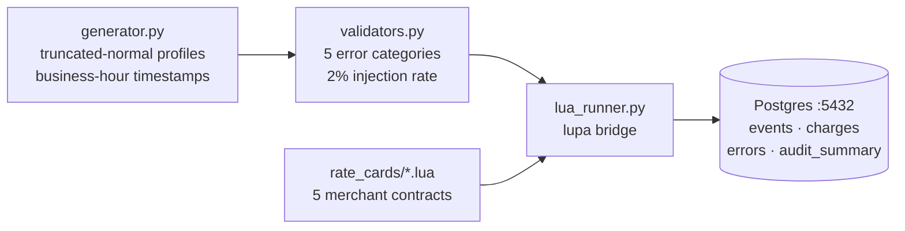

# portbill

Warehouse billing pipeline that ingests WMS activity logs, applies client-specific charge rates via **Lua scripts**, and stores structured billing data in Postgres — ready for Power BI consumption.

Built as a portfolio project for a **Data Analyst — Billing Systems** role. The Lua layer mirrors the S1B billing system used by the target company.

---

## Quickstart

```bash
git clone <repo-url>
cp .env.example .env        # set POSTGRES_PASSWORD
docker compose up --build
```

Postgres is available on `localhost:5432` within ~60 seconds.  
On first start the pipeline automatically seeds a **3-month historical backlog** (~1,800 events), then runs hourly.

Connect Power BI Desktop to `localhost:5432 / portbill` — no additional setup required.

---

## Architecture



---

## Key tables

| Table | Description |
|---|---|
| `events` | Raw WMS events with full JSONB payload |
| `charges` | Calculated billing amounts with rate card version |
| `errors` | Rejected events with category and details |
| `audit_summary` | Per-run statistics including error detection rate |

---

## Merchants & billing logic

| Merchant | Lua logic | Unit |
|---|---|---|
| NORDVIK-LOGISTICS | Three-tier pick pricing ($0.55 → $0.45 → $0.35) | cs / ea / plt |
| HARLOW-ELECTRONICS | Flat event fees + multi-unit pick surcharge | ea / unit |
| STONEGATE-APPAREL | 5-pallet grace period + scalable pack fee | ea / pc |
| COASTAL-FRESH | Cold-chain factor (1.30×) × rush factor (1.50×) | lb / cs |
| ORION-HOMEGOODS | Pallet-equivalent pricing + $15 white-glove fee | ea / pc |

---

## Stack

| Layer | Technology | Why |
|---|---|---|
| Billing calculation | Lua 5.4 via `lupa` | Mirrors the target company's S1B system |
| Application | Python 3.11 | Generator, validator, orchestration |
| Database | Postgres 16 | JSONB audit trail, native Power BI connector |
| Containerization | Docker Compose | One command, reproducible environment |

---

## Running tests

```bash
# Python (pytest)
docker compose run --rm app pytest -v

# Lua (busted)
docker compose run --rm app busted rate_cards/tests/test_rate_cards.lua
```

**21 Python tests · 23 Lua tests · 0 failures**

---

## How I'd extend this

- **Real data source** — replace the synthetic generator with a ShipHero or ShipBob webhook consumer
- **CPI adjustment** — apply each rate card's `cpi_adjustment` factor at billing-cycle close
- **Power BI semantic layer** — pre-built measures for detection rate, revenue by merchant, error trends
- **Alert on quality drop** — CI job that fails if `detection_rate < 80%` in the latest audit run
