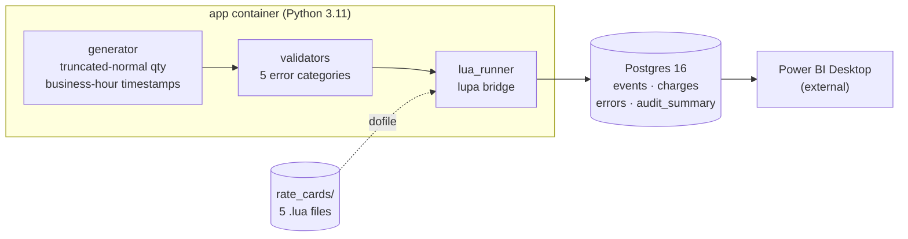

# Portbill

**A warehouse billing pipeline that turns WMS activity logs into auditable invoices.**
Events are generated, validated, priced through merchant-specific **Lua rate cards**, and persisted to **Postgres** as the analytical source of truth. Power BI connects directly to `:5432`.

Built as a portfolio for a **Data Analyst — Billing Systems** role. The Lua layer is not a stylistic choice — it mirrors the **S1B billing engine** used in production by the target company, where pricing rules ship as scripts rather than code releases.

---

## Table of contents

1. [The problem](#the-problem)
2. [Architecture](#architecture)
3. [Quickstart](#quickstart)
4. [What lands in Postgres](#what-lands-in-postgres)
5. [The Python ↔ Lua bridge](#the-python--lua-bridge)
6. [Data quality is a first-class table](#data-quality-is-a-first-class-table)
7. [The five merchants](#the-five-merchants)
8. [Tests](#tests)
9. [Deployment](#deployment)
10. [Stack & rationale](#stack--rationale)
11. [How I would extend this](#how-i-would-extend-this)

---

## The problem

A 3PL warehouse generates thousands of events per day — `receive`, `putaway`, `pick`, `pack`, `ship`, `return`, `storage_snapshot`. Each merchant has a unique contract that turns those events into money: tiered pricing, cold-chain surcharges, grace periods, white-glove fees, CPI adjustments. **Pricing rules change often.** Codifying them inside the application means every contract amendment is a code release.

Portbill solves the same way real systems do: rules live in **Lua scripts**, one per merchant, hot-loaded at runtime. The pipeline is responsible for the things rules should never do — generation, validation, persistence, audit. The math itself is a document the billing team can read and edit.

---

## Architecture



Two services, one command. The pipeline seeds a 3-month historical backlog on first start (~1 800 events spread across business hours), then runs an hourly batch using a Poisson distribution proportional to each merchant's monthly volume.

---

## Quickstart

```bash
git clone https://github.com/RafaelTavares98/portbill.git
cd portbill
cp .env.example .env                        # set POSTGRES_PASSWORD
docker compose up --build
```

First run takes ~60 seconds. You should see:

```text
[startup] Postgres connection established.
[backlog] Generating 3-month historical dataset (1 800 events)…
[backlog] Seeded 1837 events | 36 injected | 36 detected | rate 100.0%
[portbill] Pipeline live — hourly updates running.
```

Postgres is now reachable on `localhost:5432` (database `portbill`). Open Power BI Desktop → **Get Data → PostgreSQL** → connect with the credentials from your `.env`.

---

## What lands in Postgres

Four tables, three indexes, no over-engineering. Below are the queries an analyst would actually run on day one.

### Revenue per merchant, last 30 days

```sql
SELECT merchant_id,
       COUNT(*)                AS billable_events,
       ROUND(SUM(amount), 2)   AS revenue_usd
FROM   charges
WHERE  calculated_at >= NOW() - INTERVAL '30 days'
GROUP  BY merchant_id
ORDER  BY revenue_usd DESC;
```

| merchant_id          | billable_events | revenue_usd |
|----------------------|-----------------|-------------|
| COASTAL-FRESH        | 109             | 1 482.31    |
| NORDVIK-LOGISTICS    | 147             | 1 120.65    |
| ORION-HOMEGOODS      | 108             |   974.50    |
| STONEGATE-APPAREL    | 119             |   612.18    |
| HARLOW-ELECTRONICS   | 105             |   873.40    |

### Error breakdown — the data-quality story

```sql
SELECT category, COUNT(*) AS detected
FROM   errors
GROUP  BY category
ORDER  BY detected DESC;
```

`schema · business_logic · reference · duplicate · time_anomaly` — the same five categories the validator emits. A breakdown that skews toward one category points to a real upstream issue (a misconfigured WMS, a renamed merchant, a clock drift) rather than random noise.

### Detection rate over time

```sql
SELECT run_at::date, AVG(detection_rate) AS pct
FROM   audit_summary
GROUP  BY run_at::date
ORDER  BY run_at::date;
```

This is the headline KPI. The pipeline writes one `audit_summary` row per batch, with `events_generated`, `errors_injected`, `errors_detected`, and the percentage. A drop below 100 % is a regression in the validators — visible without running a single Python script.

---

## The Python ↔ Lua bridge

This is the most distinctive piece of the project, so it earns its own section. The full bridge is one file, ~40 lines: [`ingestion/src/lua_runner.py`](ingestion/src/lua_runner.py).

```python
lua  = lupa.LuaRuntime(unpack_returned_tuples=True)
card = lua.eval(f'dofile("{card_path.as_posix()}")')   # rate card returns a Lua table

handler = card[event["event_type"]]                    # pick a function by name
amount  = handler(_to_lua_table(lua, event))           # execute Lua, get a number back
```

Three design choices made this layer easy to live with:

| Choice | What it buys |
|---|---|
| **Rules loaded with `dofile`, not `import`** | A pricing change is a file edit, not a release. No module cache, no in-flight reference issues. |
| **Recursive `dict → lua.table()` walk** | Nested fields like `event.metadata.pallet_count` work natively in Lua, with `nil`-safe access (`event.metadata and event.metadata.pallet_count or 0`). |
| **Each rate card is a table of closures** | Constants stay lexically scoped to the contract that uses them — no class boilerplate, no `self`, no leakage between merchants. |

The cost: one explicit type conversion at the boundary (`_to_lua_table`). That is the entire footprint of the bridge.

### What a rate card looks like

```lua
-- rate_cards/COASTAL-FRESH.lua  (cold chain × rush)
local COLD_CHAIN_FACTOR = 1.30
local RUSH_FACTOR       = 1.50

local function cold(base, event)
  local amount = base * COLD_CHAIN_FACTOR
  if event.metadata and event.metadata.is_rush then
    amount = amount * RUSH_FACTOR
  end
  return amount
end

return {
  version = "COASTAL-v1",
  pick    = function(e) return cold(e.quantity * 0.40, e) end,
  pack    = function(e) return cold(1.60, e) end,
  -- ...
}
```

A non-engineer can read this. That is the point.

---

## Data quality is a first-class table

Most billing pipelines treat error handling as a side effect. Portbill treats it as a deliverable.

### What gets injected (synthetic ground truth)

A 2 % injection rate is applied to every batch, distributed across five categories — schema mistakes, negative quantities, unknown merchants, duplicate event IDs, future timestamps. Because injection is **deterministic and recorded**, the pipeline knows the true number of bad events.

### What gets detected (validators)

[`ingestion/src/validators.py`](ingestion/src/validators.py) runs five checks per event in fixed order — schema first (so downstream checks have the fields they need), then duplicate, business logic, reference, time anomaly. Each failure becomes a row in `errors` with the original payload preserved as JSONB.

### Detection rate (the contract)

```
detection_rate = errors_detected / errors_injected × 100
```

Written once per batch to `audit_summary`. **A run with detection_rate < 100 means a validator regressed.** The metric is on the database, queryable, plottable, and alertable — not buried in a log.

### Why duplicate detection is two-layered

```python
seen_ids: set[str] = set()           # in-memory: fast, this batch only
# ...
if event["event_id"] in seen_ids:    # caught synchronously
    errors.append(ValidationError("duplicate", ...))
```

```sql
INSERT INTO events (...) VALUES (...) ON CONFLICT (event_id) DO NOTHING
```

The Python set catches duplicates inside the same batch with no DB round-trip. The `PRIMARY KEY` on `events.event_id` is the safety net for duplicates *across* batches and across container restarts. Two failure modes, two layers — one validator can fail silently before the other one bites.

---

## The five merchants

Each contract was chosen to exercise a different Lua feature and a different real-world billing pattern.

| Merchant | Pricing pattern | Lua feature exercised |
|---|---|---|
| **NORDVIK-LOGISTICS**  | Three-tier pick pricing ($0.55 → $0.45 → $0.35) | `ipairs` table loop with break condition |
| **HARLOW-ELECTRONICS** | Flat per-event fees + multi-unit pick surcharge | Module-local fee constants |
| **STONEGATE-APPAREL**  | 5-pallet grace + storage overflow break at 20 pallets | `math.max`, conditional storage breakpoints |
| **COASTAL-FRESH**      | Cold-chain (×1.30) × rush (×1.50) on every operation | Higher-order helper closing over rate constants |
| **ORION-HOMEGOODS**    | Pallet-equivalent pricing (`ceil(qty/4)`) + $15 white-glove fee | `math.ceil` + threshold-triggered flat fee |

All five carry a `cpi_adjustment` factor for end-of-cycle reconciliation (out of scope for this MVP — see the extension section).

---

## Tests

| Layer | Runner | Count | What is being proven |
|---|---|---|---|
| Rate cards         | `busted` (Lua)  | **23** | Each pricing rule produces the exact dollar amount, including edge cases (tier breaks, grace boundaries, rush+cold compounding) |
| Event validation   | `pytest`        | **6**  | One assertion per error category, plus the happy path |
| Generator          | `pytest`        | **11** | Schema invariants, error injection produces expected mutations |
| Lua bridge         | `pytest`        | **4**  | `dict → table` round-trip, missing-handler error, version extraction |
| **Total**          |                 | **44** | All green, run in under one second |

```bash
docker compose run --rm app pytest -v
docker compose run --rm app busted rate_cards/tests/test_rate_cards.lua
```

The orchestration loop, the Postgres connection, and the Docker build are intentionally **not** tested — they fail loudly the first time you run them. Tests live where mistakes would be silent and expensive, which in a billing system means the math.

---

## Deployment

The whole stack is designed to run on **Oracle Cloud Always Free** — no credit card, no trial, indefinitely.

| Resource | Tier used | Cost |
|---|---|---|
| VM (ARM Ampere A1) | 4 OCPU, 24 GB RAM | $0 |
| Block storage | 200 GB | $0 |
| Network egress | 10 TB/month | $0 |

Deploy is intentionally manual (one SSH session, three commands). For a portfolio MVP, automating it with Terraform would add tooling without adding insight.

```bash
ssh ubuntu@<vm-ip>
git clone https://github.com/RafaelTavares98/portbill.git && cd portbill
cp .env.example .env && nano .env        # set a real password
docker compose up -d
```

Open port `5432` on the VM's security list and Power BI Desktop on a laptop talks straight to it.

---

## Stack & rationale

| Layer | Choice | Why this and not the obvious alternative |
|---|---|---|
| Pricing language     | **Lua 5.4** via `lupa` | Mirrors S1B; rules ship as files, not releases |
| Application          | **Python 3.11**        | Generator, validators, orchestration — fastest path to a working pipeline |
| Database             | **Postgres 16**        | JSONB for audit, `ON CONFLICT` for idempotency, native Power BI driver |
| Container runtime    | **Docker Compose**     | One command from clean clone to running stack; no Kubernetes, no Helm |
| Cloud                | **Oracle Always Free** | Zero recurring cost, real cloud deployment, no trial expiry |

Things deliberately **excluded** from the stack: Airflow, dbt, Kafka, Spark, Airbyte, Dagster, Snowflake, BigQuery, Terraform. Each one would add more setup time than business value for a single-merchant-tier MVP. They are the right answers for a different problem.

---

## How I would extend this

These are the changes I would actually make, in priority order, if this were a real engagement:

1. **Replace the synthetic generator with a webhook consumer.** ShipHero and ShipBob already emit events in a near-identical schema. The generator's only job is to be a stand-in; everything downstream stays unchanged.
2. **Apply `cpi_adjustment` at billing-cycle close.** Each rate card already exposes the factor. The missing piece is a monthly job that joins `charges` against the per-merchant CPI and writes a `charges_adjusted` view — exactly the kind of thing dbt or a stored procedure would own in production.
3. **Alert when `detection_rate < 95 %` for two consecutive batches.** One bad run is noise; two is a regression. A GitHub Action polling the table is enough for an MVP; PagerDuty for a paying client.
4. **Versioned rate cards with effective-date ranges.** Today the runner picks the file by merchant ID. The natural next step is `merchant_id + valid_from + valid_to` — a contract amendment becomes a new row, never a destructive overwrite, and historical recharges become possible.
5. **A semantic layer in Power BI** with prebuilt measures (revenue per merchant, detection rate, MoM growth, error mix) so the dashboard is one click rather than five.

The features that **didn't** make this list — Airflow DAGs, a Streamlit UI, a microservices split — would each cost more than they would teach. Worth saying out loud, in case anyone interviewing thinks they should have.

---

*Built with Python 3.11, Lua 5.4, Postgres 16, and the conviction that a portfolio project is worth doing properly or not at all.*
